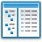

#  FileDialog Library

FileDialog Library - a library written in assembler (for x86 and x64) which consists of functions that wrap the COM implementation of the common item dialog used with IFileOpenDialog and IFileSaveDialog objects. Thus the FileDialog Library functions hide the complexities of interacting with the COM objects, and provide easy to use functions with support for both Ansi and Wide/Unicode.

[](http://www.masm32.com/download.htm) [](http://www.terraspace.co.uk/uasm.html) [![](https://img.shields.io/badge/RadASM%20-v2.2.2.x%20-red.svg?style=flat-square&colorB=C94C1E&logo=data:image/png;base64,iVBORw0KGgoAAAANSUhEUgAAABQAAAAgCAYAAAASYli2AAACcklEQVR42tWVXWiPURzHz/FyQZOiVuatuFEoKzfKSCs35EJeCqFcEEa5s2heNrXiApuXFDYveUlKSywlIRfczM0WjZvJlGKTRLb5fHvOU6fT+T/PY3bj1Kff8z8vn+f8znPO+dshihnBYv8L4awRcl2FRTarBy8bQzgEjdbabzl9nxCW2IwOFYTrsBTKEH7PET4lLLYlGpcTrkC5qxqL8HeO8CVhoQ0qRxMOw34Y5TVVIPyYI+whTLVehZ9iWgZAL1mN8G6GbArhA/TZEilqKx2HCbADXkAV0oESwhOEfdChbXOUh1ovxS+wlcH3aNvC82VX3wx7Qyl9NhEugXZEU7ixX8E6Br13nTVDPU927R3QCl0wTX2h2rUNQqUv/ATLkHUGM1hLuBF8pFipZ+zBcIZKpw1O0vjYk24mnIXxEZHGNMIBxgxJ2M2P2PF7DafhGh1/0G8Gzzv1cWASfIZn0EJ7VzpIQqWyUguulFUXiDXwApxhYE9O2ibc2PMJNbAxkp5Oyh3NGvHzQkJPrK/aANtLjNNuOAU3kf/KFTrpGsJtaIdxbu3C0gvn4Dzi3qLCI3Su4/cCnnfDBvcCv/yEW0a7o6gwWI5tJvniMwutYZbQa9elsUqzgun/JKStjKAzvAvmDXuG1M1xqerkTAyG6Cy3FREeM8k2kag6MomvcBGaefG7LOF6k1wK6SUbFl0iOpqt/v+NjYjmEva4NQpPi9K6b5JN/UiXQTg+vbF1nlc4USytPpNcok1Iuk1G0eWgS0Hnd3akXbeIbuqWvP9lXxhOW2k9cOvzMJZWUWG/Sf4/lNbbv5GEwjeSSIaof7iitPwBoSgbVud1Jo0AAAAASUVORK5CYII=)](http://www.softpedia.com/get/Programming/File-Editors/RadASM.shtml) [](https://datetime-library.readthedocs.io/en/latest/index.html)

# Features

* Open File Dialog Functions: `FileOpenDialogA` & `FileOpenDialogW`
* Save File Dialog Functions: `FileSaveDialogA` & `FileSaveDialogW`
* Folder Select Dialog Functions: `FolderSelectDialogA` & `FolderSelectDialogW`

# Download

* Download the latest release for whichever assembler and architecture you require:
  
  - [FileDialog-x86.zip](https://github.com/mrfearless/FileDialog-Library/blob/master/releases/FileDialog-x86.zip?raw=true)
  - [FileDialog-x64.zip](https://github.com/mrfearless/FileDialog-Library/blob/master/releases/FileDialog-x64.zip?raw=true)

* Copy `FileDialog.inc` to your `masm32\include` folder for FileDialog Library x86, or `uasm\include` for FileDialog Library x64 (or wherever your include files are located)

* Copy `FileDialog.lib` to your `masm32\lib` folder for FileDialog Library x86, or `uasm\lib\x64` for FileDialog Library x64 (or wherever your libraries are located)

* Add the following to your project:
  
  ```assembly
  include FileDialog.inc
  includelib FileDialog.lib
  ```

# Functions

Documentation on the functions in the FileDialog libraries are located on readthedocs [here](https://filedialog-library.readthedocs.io/en/latest/index.html)

# Resources

Included with the releases are additional RadASM autocomplete / intellisense type files. Each `*.api.txt` file contains instructions as to where to paste their contents. 

Other resources may be required to build the libraries:

- [RadASM IDE](http://www.softpedia.com/get/Programming/File-Editors/RadASM.shtml)
- [MASM32 SDK](http://www.masm32.com/download.htm)
- [UASM - x86/x64 assembler](http://www.terraspace.co.uk/uasm.html)
- [WinInc - include files for x64 assembler](http://www.terraspace.co.uk/WinInc209.zip)
- [UASM-with-RadASM](https://github.com/mrfearless/UASM-with-RadASM)
